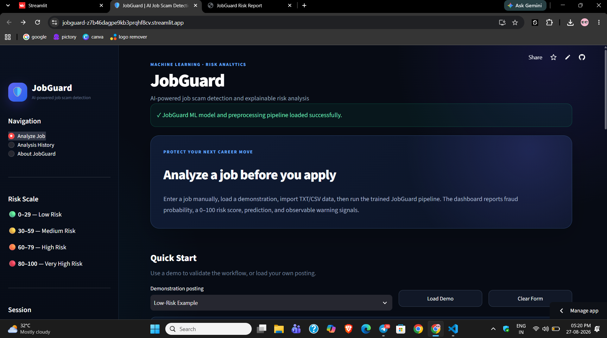
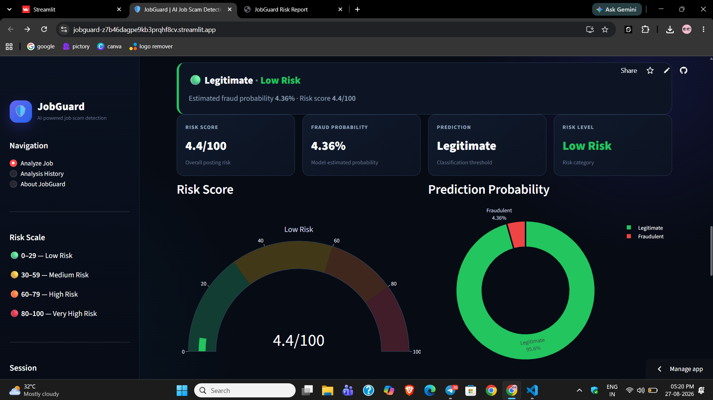
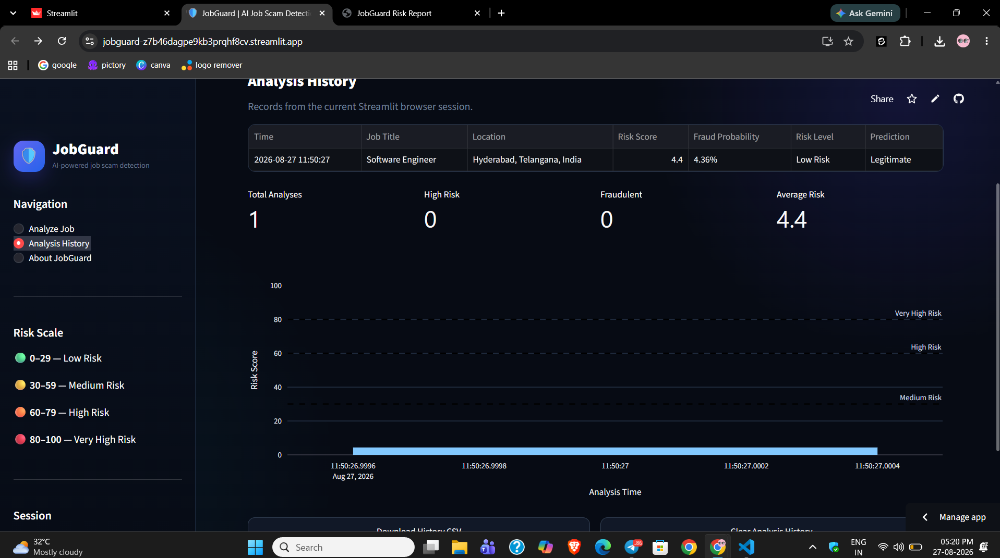

# JobGuard — Job Scam Detection & Risk Analytics Platform

JobGuard is a machine-learning-powered job scam detection and risk analytics platform that evaluates job postings and estimates their likelihood of being fraudulent.

The project combines data analysis, feature engineering, machine learning, risk scoring, explainable warning indicators, interactive visualization, and Streamlit deployment into an end-to-end analytics solution.

## Live Demo

**[Launch JobGuard](https://jobguard-z7b46dagpe9kb3prqhf8cv.streamlit.app/)**

## GitHub Repository

**[View Source Code](https://github.com/Kodhanda1223/JobGuard)**

---

## Project Overview

Online job scams can contain observable warning signals such as:

- Requests for money or payment
- Requests for bank or financial information
- Urgent action requirements
- Guaranteed income claims
- Suspicious job descriptions
- Unusual posting characteristics

JobGuard analyzes these signals along with textual and structured job-posting features and produces:

- Fraud probability
- 0–100 risk score
- Risk classification
- Observable warning signals
- Analysis history
- Interactive analytics
- Downloadable reports

---

## Business Problem

Online job seekers may encounter fraudulent job postings that contain suspicious financial requests, unrealistic income promises, urgent instructions, or other warning indicators.

Manually evaluating these signals across large numbers of job postings can be difficult.

JobGuard addresses this problem by applying a machine-learning classification model and an analytical risk-scoring framework to job-posting data.

The system transforms job-posting information into measurable features, predicts fraud probability, converts the prediction into an interpretable risk score, and presents the results through an interactive dashboard.

---

## Objectives

The main objectives of JobGuard are to:

1. Detect potentially fraudulent job postings.
2. Quantify job-posting risk using a 0–100 score.
3. Identify observable warning signals.
4. Apply machine learning to textual and structured job data.
5. Build an interactive analytics dashboard.
6. Make model predictions easier to interpret.
7. Demonstrate an end-to-end Data Analytics and Machine Learning workflow.
8. Deploy the analytical solution as a live web application.

---

## Application Preview

### Main Dashboard

The JobGuard dashboard provides an interactive interface for analyzing job postings and reviewing risk indicators.



---

### Risk Analysis

The analysis view presents the model's fraud probability, overall risk score, prediction, and observable warning signals.



---

### Analysis History

JobGuard provides an analysis history view for reviewing previously analyzed job postings during the current application session.



---

## Machine Learning Approach

JobGuard uses a **Logistic Regression** classification model.

### Machine Learning Workflow

```text
Raw Job Dataset
       |
       v
Data Understanding
       |
       v
Data Cleaning
       |
       v
Feature Engineering
       |
       v
Text + Structured Features
       |
       v
Preprocessing Pipeline
       |
       v
Logistic Regression
       |
       v
Fraud Probability
       |
       v
Risk Score
       |
       v
Risk Classification
       |
       v
Warning Signals
       |
       v
Streamlit Dashboard